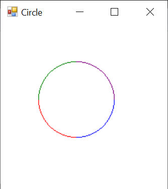

# Requirements

Draw a circle into a framebuffer using only integer math.

# Algorithm

[Midpoint circle algorithm](https://en.wikipedia.org/wiki/Midpoint_circle_algorithm):
The basic idea is you start at an easily calculable point (the top for example). You choose the next
point that is closest to the ideal circle. You continue in this way till you reach another easily
calculable point. The left side of the circle for example. Since the circle is symtric across any line
that passes through the center, you can draw multiples sides simultaniously.

In this example, each segment of different color was draw simulataniously.

# TODO

The program draws four segments simultaneously. It is possible to draw eight.
